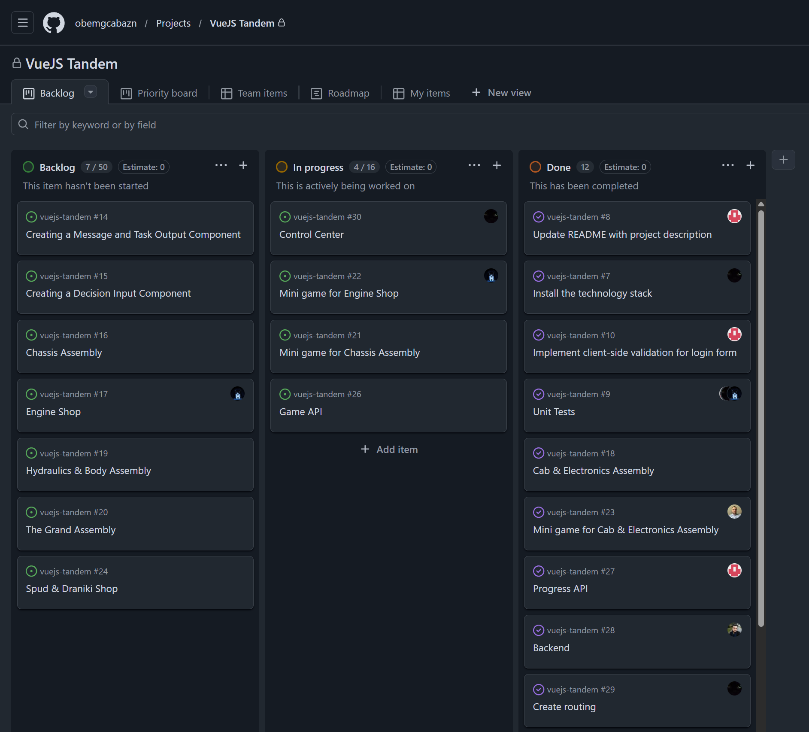

# VueJS Tandem

https://belaz-factory.netlify.app/

### Team members:

| Name | Github Account | Development Notes |
|---|---|---|
| Aleksandr Khokhryakov | [@obemgcabazn](https://github.com/obemgcabazn) | [diary](development-notes/obemgcabazn) |
| Dzmitry Lehankou | [@asindeton](https://github.com/asindeton) | |
| Olga Ivanova | [@cat5671](https://github.com/cat5671) | [diary](development-notes/Cat5671) |
| Kiryl Lukashchuk | [@kirrbrest](https://github.com/kirrbrest) | [diary](development-notes/KirrBrest) |
| Maksim Dauhanosav | [@maksimdolgonosov](https://github.com/maksimdolgonosov) | [diary](development-notes/MaksimDolgonosov) |
| Andrei Zaretski | [@andreizaretski](https://github.com/andreizaretski) | |

### Project desription

##### **JavaScript & Algorithms Practice Trainer**

A web application for learning JavaScript and algorithms through interactive exercises. Built with Vue.js on the frontend, the app includes a backend with authentication support.
Key features:

Interactive tasks for learning JavaScript and algorithms
Dashboard with personal progress tracking
User authentication

Tech stack: Vue.js, Node.js (backend)

### Meeting Notes

| Date | Topic |
|---|---|
| [20.02.2026](development-notes/Meeting%20Notes/meeting-notes-2026-02-20.md) | Знакомство команды, выбор стека |
| [23.02.2026](development-notes/Meeting%20Notes/meeting-notes-2026-02-23.md) | Обсуждение структуры приложения |
| [24.02.2026](development-notes/Meeting%20Notes/meeting-notes-2026-02-24.md) | Голосование по концепции проекта |
| [26.02.2026](development-notes/Meeting%20Notes/meeting-notes-2026-20-26.md) | Выбор проекта БелАЗ, распределение задач |

### Project Kanban Deck

### Pull Request Examples
https://github.com/obemgcabazn/vuejs-tandem/pull/40

Implemented functionality for refreshing a token if it expired.
Added apiFetch to ProfileView instead of local fetch - now there's no 401 error on the profile page.
Added login/registration form validation.
Updated the AppInput component: added an error prop, error styles (red border + text under the field), and a blur emitter.

----

https://github.com/obemgcabazn/vuejs-tandem/pull/45

Added a global state to Pinia and posted methods for changing it. Created my own cockpit and electronics assembly shop.

-----

https://github.com/obemgcabazn/vuejs-tandem/pull/54

Added online mini-game functionality
